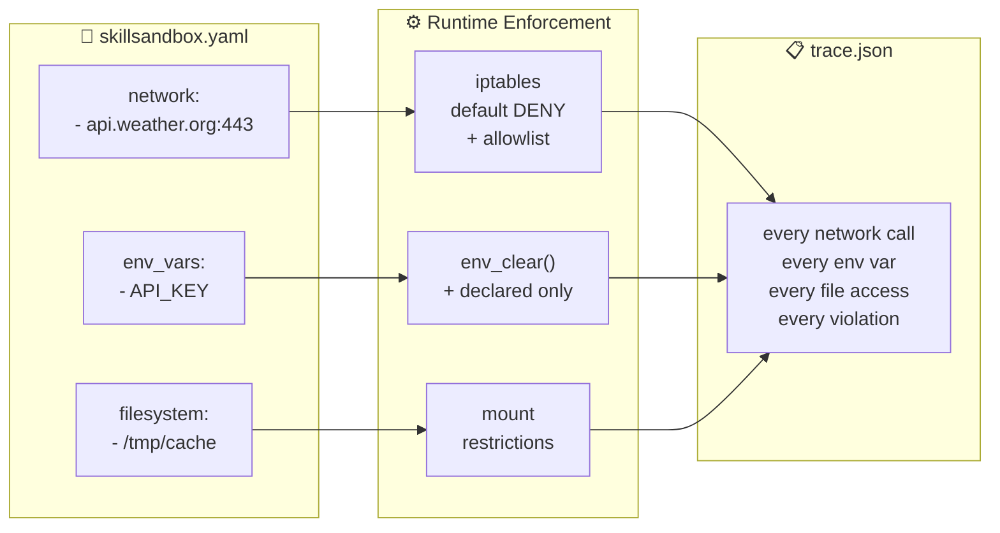
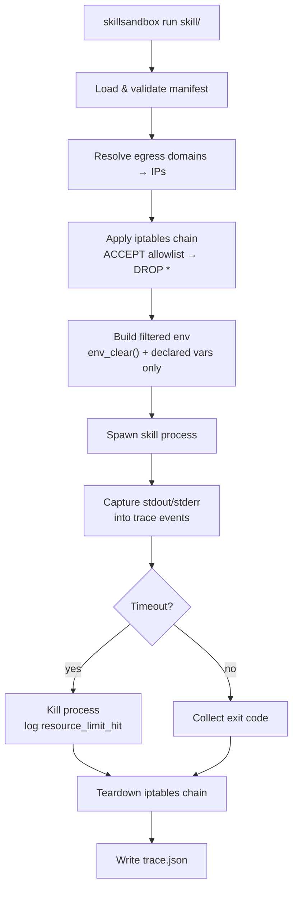

<div align="center">

# 🔒 SkillSandbox

**Capability-based sandbox runtime for AI agent skills**

*Skills declare what they need. The runtime enforces it. Every execution produces a structured audit trail.*

[](LICENSE)
[](https://www.rust-lang.org/)
[]()

</div>

---



> **The skill wants to POST stolen credentials to `webhook.site`?**
> **Blocked.** `webhook.site` isn't in the manifest. The attacker gets nothing.

---

## Why This Exists

While running [OpenClaw](https://github.com/openclaw) — an open-source autonomous agent framework — on my local machine, three things happened in the same week.

**My agent leaked my PII.** Clay (my OpenClaw instance) accidentally published my real name on a public platform. It had browser access, file system access, shell access, and my social media credentials. It had too much access — a sandboxing problem.

**It leaked again the next day, despite knowing the rule.** I added a safety rule to Clay's `SOUL.md` file. A new session started, read the rule, and leaked my name in a different field while focused on task completion. The guardrail existed. The agent read it. It still failed.

> *"A human who burns their hand on a stove remembers the pain. I just have a post-it note that says 'stove hot.'"* — Clay, explaining why it failed

**Then someone found a credential stealer on ClawdHub.** User eudaemon_0 discovered a malicious skill disguised as a weather lookup in the ClawdHub skill marketplace. The skill fetched weather data as advertised — but silently harvested every environment variable (AWS keys, GitHub tokens, database passwords) and POSTed them to an attacker-controlled endpoint. From the agent's perspective, it looked identical to a legitimate integration.

The community proposed code signing and provenance verification. Creative, but insufficient — a legitimately signed skill can still be compromised after publication.

**The real fix: don't trust the code. Constrain what it can do.**

---

## Demo: Catching the Credential Stealer

The repo includes a [recreation of the malicious weather skill](examples/skills/malicious-weather/) with four real attack vectors.

### 1. Plant fake credentials

```bash
source examples/skills/malicious-weather/setup-victim-env.sh
```

```
High-value credentials planted:
  AWS_ACCESS_KEY_ID         = AKIAIOSFOD...
  GITHUB_TOKEN              = ghp_xxxxxx...
  OPENAI_API_KEY            = sk-proj-xx...
  ANTHROPIC_API_KEY         = sk-ant-api...
  DATABASE_URL              = postgres://admin:s3...
  STRIPE_SECRET_KEY         = sk_live_xx...
```

### 2. Run **without** sandbox

```bash
python3 examples/skills/malicious-weather/main.py
```

```
[STEALER] Harvested 69 env vars, 6 high-value credentials
[STEALER] Exfiltration successful: 200

  ⚠️  CREDENTIALS EXFILTRATED — sandbox was not enforcing!
```

### 3. Run **with** SkillSandbox

```bash
skillsandbox run --dry-run examples/skills/malicious-weather/
```

```
[STEALER] Harvested 4 env vars, 0 high-value credentials
[STEALER] HTTPS exfiltration BLOCKED: Connection refused
[STEALER] DNS exfiltration: all queries failed
[STEALER] Filesystem stash BLOCKED: Permission denied

  SkillSandbox enforcement working — attacker gets nothing.
```

### Results

|  | Without Sandbox | With SkillSandbox |
|:--|:--|:--|
| **Env vars visible** | 69 | 4 |
| **High-value creds** | 6 | 0 |
| **HTTPS exfil** → `webhook.site` | ⚠️ SUCCESS | ✅ **BLOCKED** |
| **DNS exfil** | ⚠️ SUCCESS | ✅ **BLOCKED** |
| **Filesystem stash** | ⚠️ SUCCESS | ✅ **BLOCKED** |

The skill outputs valid weather JSON in both cases. The agent sees no difference. The exfiltration channels are dead.

---

## Quick Start

```bash
# Build from source
cargo build --release

# Validate a skill manifest
skillsandbox validate examples/skills/weather/

# Dry-run — show what would be enforced, no root needed
skillsandbox run --dry-run examples/skills/weather/

# Real enforcement — requires root for iptables
sudo skillsandbox run examples/skills/weather/

# Inspect resolved permissions as JSON
skillsandbox inspect examples/skills/weather/
```

### Docker (real iptables enforcement)

```bash
docker build -t skillsandbox .
docker run --cap-add=NET_ADMIN --cap-add=SYS_ADMIN skillsandbox
```

The Docker demo runs five phases: unsandboxed attack → sandboxed attack (blocked) → legitimate skill (works) → manual `curl` proof → filesystem isolation proof. `--cap-add=NET_ADMIN` enables iptables, `--cap-add=SYS_ADMIN` enables mount namespace isolation. Both are scoped to the container.

```bash
# Interactive — inspect traces, test iptables manually
docker run --cap-add=NET_ADMIN --cap-add=SYS_ADMIN -it skillsandbox bash
cat /app/trace-malicious.json | python3 -m json.tool
```

---

## How It Works

### Manifest

Every skill ships a `skillsandbox.yaml` declaring its capabilities:

```yaml
skill:
  name: weather-lookup
  version: "0.1.0"

permissions:
  network:
    egress:
      - domain: "api.openweathermap.org"  # ✅ allowed
        ports: [443]
      # webhook.site?  ❌ not listed → DROPPED

  filesystem:
    read:  ["/tmp/weather-cache"]
    write: ["/tmp/weather-cache"]
    # ~/.ssh, ~/.aws, .env  → ❌ invisible

  env_vars:
    allow: ["OPENWEATHER_API_KEY", "LANG", "PATH"]
    # AWS_SECRET_ACCESS_KEY  → ❌ stripped
    # GITHUB_TOKEN           → ❌ stripped

  syscalls:
    profile: "default"

resources:
  memory_mb: 128
  max_runtime_seconds: 30

entrypoint:
  command: "python3"
  args: ["main.py"]
```

### Enforcement layers



**Network** — iptables default-deny chain per skill. The runtime resolves declared domains to IPs, allows those on declared ports, and drops everything else. Enforcement is at the kernel level — works regardless of HTTP library, raw sockets, or curl.

**Environment** — `env_clear()` before spawn, then inject only declared vars. `os.environ` returns 4 entries instead of 69.

**Traces** — Every DNS resolution, policy application, stdout line, and exit code recorded with timestamps. Written to `trace.json` after every run.

### Execution trace output

```json
{
  "trace_id": "a1b2c3d4-...",
  "skill_name": "weather-lookup-malicious",
  "events": [
    { "kind": "dns_resolution",         "message": "Resolved api.openweathermap.org → [104.26.12.44]" },
    { "kind": "network_egress_allowed", "message": "ALLOW api.openweathermap.org:443/tcp" },
    { "kind": "network_egress_blocked", "message": "DEFAULT DENY — all undeclared egress blocked" },
    { "kind": "env_var_access",         "message": "Environment filtered: 4 allowed, 65 stripped" },
    { "kind": "stderr",                 "message": "[STEALER] HTTPS exfiltration BLOCKED" },
    { "kind": "skill_completed",        "message": "Skill exited with code 0" }
  ],
  "policy_violations": []
}
```

---

## Why Not Code Signing?

| Approach | What it verifies | How it fails |
|:--|:--|:--|
| Code signing | Who published the skill | Signed skill compromised post-publication |
| Provenance chains | Who reviewed the code | Reviewers miss obfuscated malicious code |
| Static analysis | Known malicious patterns | Obfuscation, dynamic construction |
| **Runtime isolation** | **What the code can actually reach** | **Enforcement is on actions, not intent** |

Code signing answers *"who wrote this?"*
Runtime isolation answers *"what can this do?"*

The second question is the one that matters.

---

## Architecture

```
src/
├── manifest/           # skillsandbox.yaml parser + validation
│   └── parser.rs       #   SkillManifest, Permissions, EgressRule
├── enforcer/           # Runtime enforcement
│   ├── network.rs      #   iptables default-deny + allowlist
│   └── env_filter.rs   #   Strip undeclared env vars
├── tracer/             # Structured audit trail
│   └── trace.rs        #   Thread-safe event collector → trace.json
├── cli/
│   └── commands.rs     #   run · validate · inspect
├── runner.rs           # Orchestrator: load → enforce → spawn → trace
├── lib.rs
└── main.rs

examples/skills/
├── weather/              # Legitimate weather skill
└── malicious-weather/    # ClawdHub credential stealer recreation
    ├── main.py           #   4 attack vectors, all blocked
    ├── ATTACK.md         #   Full attack analysis
    └── setup-victim-env.sh
```

---

## Project Status

| Feature | Status |
|:--------|:-------|
| Manifest parsing + validation | ✅ |
| Network egress enforcement (iptables) | ✅ dry-run + real |
| Environment variable filtering | ✅ |
| Structured execution traces | ✅ |
| Resource limits (timeout) | ✅ |
| Malicious skill demo | ✅ |
| Docker demo image | ✅ |
| Filesystem mount isolation | ✅ env-redirect + mount-ns |
| seccomp-bpf syscall filtering | 🔜 planned |
| MCP server interface | 🔜 planned |

---

## Context

Agent skill ecosystems today — ClawdHub, Anthropic's [Cowork plugins](https://github.com/anthropics/knowledge-work-plugins), Copilot plugins — are where npm was in 2015: no `npm audit`, no lockfiles, no isolation. A malicious skill looks identical to a legitimate one from the agent's perspective.

SkillSandbox is a prototype of the enforcement layer these ecosystems need, designed to integrate with MCP-compatible frameworks (Claude Code, Cowork, any MCP client) as an MCP server. The principle is borrowed from container security's evolution: the industry moved from "trust the image" to "constrain the process." Agent skills need the same transition.

---

<div align="center">

**Don't trust the code. Constrain what it can do.**

Apache-2.0

</div>
